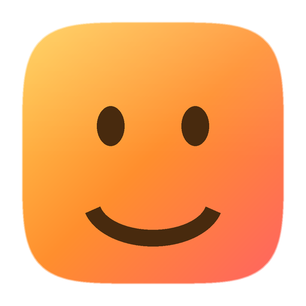
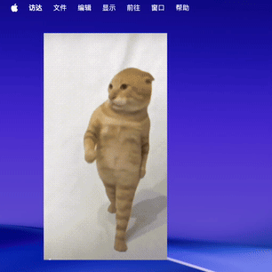

<div align="center">



# MemeDesk · 桌面表情包播放器

**让表情包住进你的 macOS 桌面，24 小时循环播放。**

[](https://github.com/sdtafxy/MemeDesk/actions/workflows/ci.yml)

[English](README.en.md)


GIF / APNG / 静态图 / MP4 / MOV · 多开 · 不占 Dock · 中英双语



</div>

---

表情包是聊天里的通用货币，但离开聊天框就没了灵魂。MemeDesk 把它们放回你盯得最久的地方——
桌面壁纸之上：想放几个放几个，每个都能拖动、缩放、旋转、弹跳、追随鼠标，
看视频时自动安静，锁屏时自动休息。

## 功能亮点

- **多开**：同时摆任意多个，各自独立配置，重启后原样恢复（Security-Scoped Bookmark）。
- **格式全**：GIF / APNG / PNG / JPG / HEIC / WebP / MP4 / MOV / M4V，
  扩展名、UTType、文件魔数三重判定，视频自动去音轨循环。
- **三种图层**：沉在图标下、贴伏在桌面上（默认）、悬浮于一切之上。
- **六种行为**：静止、呼吸浮动、屏幕弹跳、重力吊床、追随鼠标、随机游荡。
- **单实例控制**：大小、不透明度、播放速度、旋转、镜像、鼠标穿透、锁定，右键即达。
- **低占用**：大图先降采样再解码（阈值可调），被遮挡 / 全屏 / 锁屏 / 用电池时自动暂停。
- **只驻菜单栏**：`LSUIElement` 应用，Dock 和 App 切换器里都看不到。
- **中英双语**：默认跟随系统，可在设置里手动切换。
- **`memedesk://` URL Scheme**：配合快捷键、Raycast、Alfred 一句话控制。
- **内置 6 个示例素材**：打开素材库即可一键投放。

## 快速开始

从 [Releases](../../releases) 下载最新的 `MemeDesk-x.y.z.dmg`，拖进 Applications，打开即可。

> 产物为 ad-hoc 签名。首次启动若被 Gatekeeper 拦下，右键 App 选择「打开」。

想自己构建（需要**完整 Xcode**，只有 Command Line Tools 编译不了 SwiftUI）：

```bash
xcode-select --install          # 已安装可跳过
./Scripts/build.sh              # → dist/MemeDesk.app
open dist/MemeDesk.app
```

需要磁盘镜像再执行 `./Scripts/make_dmg.sh`；用完整 Xcode 工程调试：

```bash
brew install xcodegen
xcodegen -s Xcode/project.yml   # 生成 MemeDesk.xcodeproj
open MemeDesk.xcodeproj
```

## 使用

| 操作 | 效果 |
| --- | --- |
| 点击菜单栏图标 | 控制面板：添加、素材库、设置、批量收起 / 暂停 |
| 拖动表情包 | 移动（带边缘吸附，不会拖出屏幕找不回来） |
| `Option` + 拖动 | 等比缩放 |
| 滚轮 | 微调大小 |
| 右键 | 大小 / 不透明度 / 速度 / 旋转 / 图层 / 行为 / 镜像 / 穿透 / 锁定 / 复制 / 移除 |
| 双击 | 单独暂停 / 继续这一个实例 |
| 拖拽文件到素材库窗口 | 直接投放桌面 |
| `⌘ ,` | 打开设置 |

菜单栏面板的六个按钮：**暂停 / 继续播放**、**素材库**、**设置**、**全部收起 / 全部显示**、
**清空桌面**、**退出**。

### URL Scheme

```bash
open "memedesk://add?file=/Users/me/cat.gif"   # 投放指定文件
open "memedesk://hide"                          # 全部收起
open "memedesk://show"                          # 全部显示
open "memedesk://pause"                         # 全局暂停
open "memedesk://resume"                        # 全局继续
open "memedesk://clear"                         # 清空桌面
```

### 三种图层

- **沉在图标下**：夹在壁纸与 Finder 图标之间，最接近原生观感；但 macOS 会吞掉低于普通窗口层级的鼠标事件，该模式下交互不可用。
- **贴伏在桌面上**（默认）：压住桌面图标，被任何 App 窗口盖住。
- **悬浮于一切之上**：连全屏视频也盖得住。

## 低占用是怎么做到的

1. **全局单一帧驱动源**：所有实例共用一个 Timer，频率按最快的客户端协商——10fps 的 GIF 只会让时钟跑在 15Hz 左右，没有活跃实例时 Timer 被彻底释放。
2. **按显示尺寸解码**：通过 ImageIO 的 thumbnail 接口直接解出显示大小的位图。800×800 的 GIF 放在 200pt 窗口里只解 400px，内存与耗时约为全尺寸解码的四分之一。
3. **解码不进主线程**：后台串行队列解码并预取接下来 5 帧，未命中就继续显示上一帧，绝不阻塞。缓存按字节数限流，LRU 淘汰。
4. **见好就收**：被完全遮挡、全屏应用在前台、锁屏、使用电池时自动暂停；视频循环前剥离音轨，省下解码器的音频管线。

## 设计

菜单栏面板、欢迎页、设置、素材库共用同一套设计语言：纯白底（深色模式近黑）、
灰色块按钮、品牌橙只留给主操作。颜色、圆角、字号集中在 `Sources/MemeDesk/UI/Design.swift`，
App 图标由 `Scripts/make_icon.py` 从同一个 1024px 母版生成 `.icns` 与 `.png`——
Finder 里显示的、菜单栏里点到的、欢迎页看到的，永远是同一张脸。

## 环境要求

- macOS 13 Ventura 及以上
- 源码构建需要完整 Xcode（仅 Command Line Tools 会因缺少 SwiftUI 宏插件而编译失败）

## 许可证

[MIT](LICENSE)
